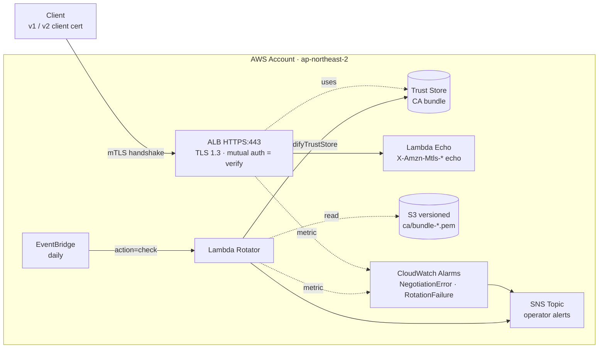

# ALB mTLS Demo

End-to-end demo of **ALB mutual TLS (mTLS) with zero-downtime trust store rotation**, built with AWS CDK v2.

The stack provisions an ALB in `verify` mode, a Lambda echo backend, a versioned S3 bucket of CA bundles, an EventBridge-scheduled rotator Lambda, CloudWatch alarms, and an SNS topic for notifications.

> Operational procedure and the rolling-rotation strategy are detailed in [ROTATION-GUIDE.md](ROTATION-GUIDE.md).

## Architecture



## Prerequisites

- AWS CLI configured with credentials (default region used in scripts: `ap-northeast-2`)
- Node 20+ / npm 10+
- AWS CDK v2 (`npm i -g aws-cdk`)
- OpenSSL 3.x
- Bash (Git Bash on Windows works — paths handled accordingly)

## One-time bootstrap

```bash
cd alb-mtls-demo
npm install

ACCOUNT=$(aws sts get-caller-identity --query Account --output text)
npx cdk bootstrap aws://$ACCOUNT/ap-northeast-2
```

## Deploy

```bash
# 1) Simulate intermediary CAs (v1, v2) and generate the three bundles
./scripts/simulate-intermediary-ca.sh

# 2) Self-signed server cert for the ALB → import into ACM
./scripts/import-server-cert.sh
# Copy the printed ARN.

# 3) CDK deploy
npx cdk deploy \
  -c serverCertArn=arn:aws:acm:ap-northeast-2:<ACCOUNT_ID>:certificate/<UUID> \
  -c notificationEmail=you@example.com   # optional
```

Stack outputs:

- `AlbDnsName` — the test target
- `BundleBucketName` — for bundle uploads
- `RotatorFunctionName` — for direct Lambda invocation
- `TrustStoreArn`
- `SnsTopicArn`

## Verify

```bash
./test-client/run-test.sh <AlbDnsName>
```

Expected results across rotation phases:

| Scenario | A. v1 only (initial) | B. v1+v2 rollover | C. v2 only |
|---|---|---|---|
| v1 client cert | 200 OK | 200 OK | TLS rejected |
| no client cert | TLS rejected | TLS rejected | TLS rejected |
| v2 client cert | TLS rejected | 200 OK | 200 OK |

A successful response includes the ALB's mTLS metadata headers (Subject, Issuer, Serial-Number, Validity, Leaf — see [ROTATION-GUIDE.md](ROTATION-GUIDE.md#8-verification-matrix-validated-by-the-demo) for an example).

## Rotation simulation

```bash
export ROTATOR_FN=<RotatorFunctionName>
export BUNDLE_BUCKET=<BundleBucketName>

# Overlap window — both v1 and v2 trusted
./scripts/rotate.sh ca/bundle-rollover.pem
./test-client/run-test.sh <AlbDnsName>   # both v1 and v2 → 200

# Cutover — only v2 trusted
./scripts/rotate.sh ca/bundle-rotated.pem
./test-client/run-test.sh <AlbDnsName>   # v1 rejected, v2 → 200
```

## Tear down (mandatory — ALB is billed hourly)

```bash
./scripts/destroy.sh <SERVER_CERT_ARN>
```

What it does:

1. `cdk destroy --force` — removes the entire stack
2. Deletes the imported ACM certificate

## Cost notes

- **ALB**: ~$0.027/hour + LCUs
- **NAT Gateway**: not used
- **Lambda + EventBridge + S3 + KMS**: effectively free at demo scale
- **Estimated**: ~$0.7/day while the stack is up

## Implementation notes

- **In-place trust store swap** — `ModifyTrustStore` keeps the trust store ARN and only swaps the CA bundle. No listener redeploy, no DNS change, no downtime.
- **Rollover bundle** = v1 PEM concatenated with v2 PEM. Apply for ~30 days before and ~7 days after the planned cutover so both client cert generations are accepted simultaneously.
- **Backend headers** (verify mode emits 5):
  - `X-Amzn-Mtls-Clientcert-Subject`
  - `X-Amzn-Mtls-Clientcert-Issuer`
  - `X-Amzn-Mtls-Clientcert-Serial-Number`
  - `X-Amzn-Mtls-Clientcert-Validity` (NotBefore / NotAfter)
  - `X-Amzn-Mtls-Clientcert-Leaf` (URL-encoded full PEM)
- **`AdvertiseTrustStoreCaNames=on`** — clients with multiple installed certificates pick the right one automatically.
- **Key CloudWatch metric**: `ClientTLSNegotiationErrorCount` — a spike means handshakes are failing (wrong / missing / revoked CA).

## File layout

```
alb-mtls-demo/
├── bin/app.ts                       # CDK app entrypoint
├── lib/mtls-stack.ts                # Main stack
├── lambda/
│   ├── echo/index.py                # ALB backend (mTLS header echo)
│   └── rotator/index.py             # Trust store rotation logic
├── scripts/
│   ├── simulate-intermediary-ca.sh  # OpenSSL CAs + client certs + bundles
│   ├── import-server-cert.sh        # ALB server cert → ACM import
│   ├── rotate.sh                    # S3 upload + rotator invoke
│   └── destroy.sh                   # Stack + ACM teardown
├── test-client/
│   └── run-test.sh                  # 3 curl scenarios
├── ca/                              # (generated) CAs + bundles  — gitignored
└── server/                          # (generated) server key + cert — gitignored
```

## References

- [ROTATION-GUIDE.md](ROTATION-GUIDE.md) — rolling rotation procedure, sequence diagrams, operations checklist
- [ALB mutual authentication](https://docs.aws.amazon.com/elasticloadbalancing/latest/application/mutual-authentication.html)
- [Configuring mTLS on ALB](https://docs.aws.amazon.com/elasticloadbalancing/latest/application/configuring-mtls-with-elb.html)

## License

[MIT](LICENSE)
