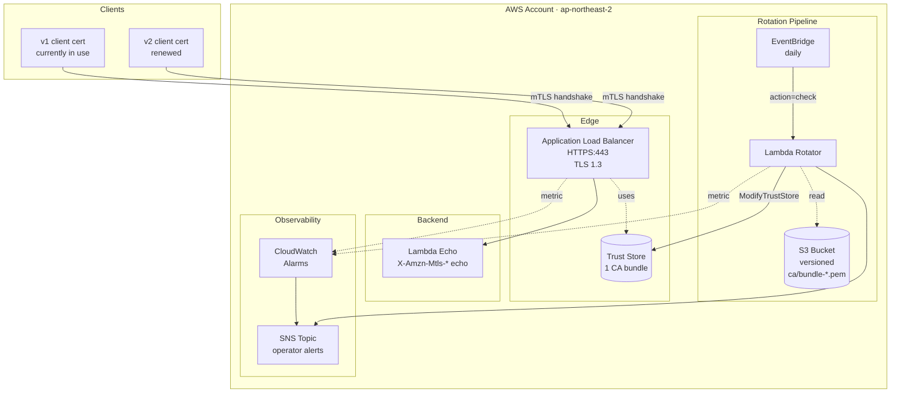
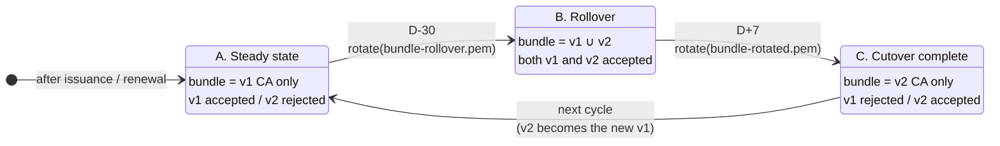
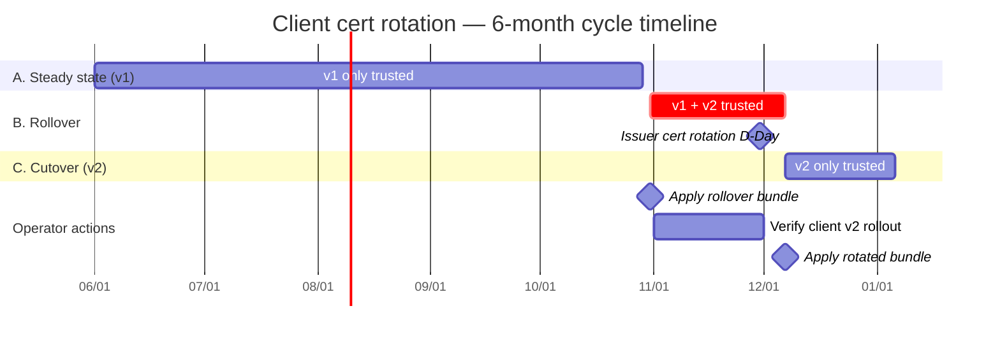
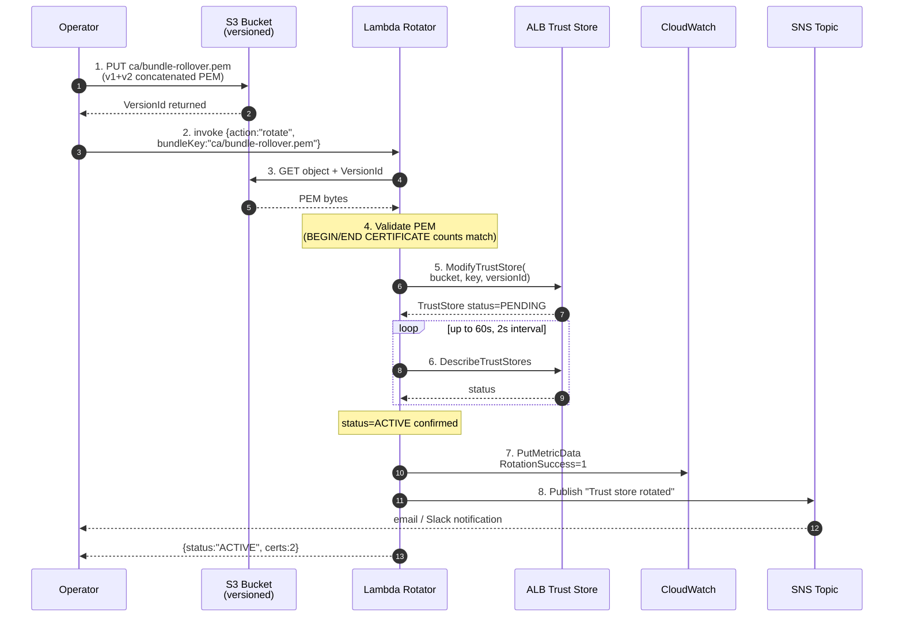
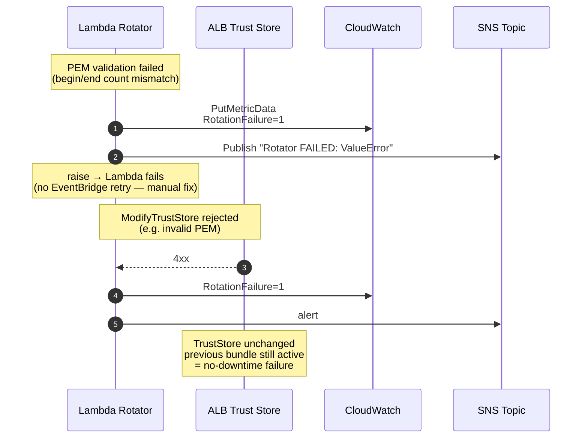
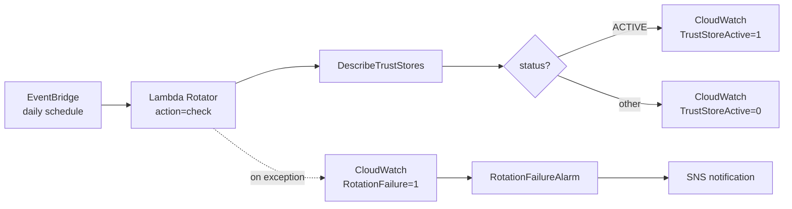

# ALB mTLS — Zero-Downtime Trust Store Rotation Guide

Client CAs in mTLS deployments are typically rotated on a fixed cadence (every 6 or 12 months). This document describes how to swap an ALB Trust Store **in place** — without redeploying listeners, changing DNS, or causing downtime — and how to operate the rotation safely.

## 1. Core idea — Rollover bundle

An ALB Trust Store points at **a single PEM bundle** that holds the trusted CA list. When the upstream issuer publishes a new CA, you walk through three bundles:

| Phase | Bundle | Operating state | Recommended window |
|---|---|---|---|
| A. Steady state | v1 CA only | only v1 clients accepted | normal operation |
| **B. Rollover** | **v1 + v2 CA concatenated** | **both v1 and v2 accepted** | **D-30 to D+7** |
| C. Cutover complete | v2 CA only | only v2 clients accepted | from D+8 |

**Why in-place works:** the `ModifyTrustStore` API keeps the trust store ARN unchanged and only swaps its bundle contents. **No listener redeploy, no DNS change, no downtime.** Client-side rollouts can drift from the publisher's schedule, and the rollover bundle absorbs that drift by accepting both generations at once.

---

## 2. Architecture



---

## 3. Three rotation phases — state diagram



---

## 4. Operations timeline — example 6-month cycle



> **Why D-30 / D+7:** publishers commonly issue the new CA somewhere in the D-10 ~ D-1 window, but downstream clients roll out at their own pace. The 30-day pre-buffer absorbs early publishers; the 7-day post-buffer absorbs lagging clients.

---

## 5. Rotation sequence (one rotation = one Lambda invocation)



### Failure path (defense in depth)



**Key invariant:** rotation either fully succeeds, or fails and leaves the previous state intact. There is no partial-failure state where traffic is broken.

---

## 6. Daily liveness check (`action: check`)

EventBridge invokes the Rotator once a day with the `check` action.



Purpose:

- "Is the rotator alive?" — daily liveness; any exception lights up `RotationFailure` → alarm → SNS
- Visibility on `TrustStoreActive` for dashboards

> ⚠️ The current stack only alarms on `RotationFailure`. For production, consider adding an alarm on `TrustStoreActive < 1`.

---

## 7. Operations runbook

### Enter Phase B (D-30)

```bash
# 0) Concatenate the upstream CAs into a single PEM
cat ca/v1/intermediary-ca.crt ca/v2/intermediary-ca.crt > ca/bundle-rollover.pem

# 1) One-shot rotation
export ROTATOR_FN=<RotatorFunctionName>
export BUNDLE_BUCKET=<BundleBucketName>
./scripts/rotate.sh ca/bundle-rollover.pem

# 2) Verify — both v1 and v2 clients should return 200
./test-client/run-test.sh <AlbDnsName>
```

### Enter Phase C (D+7)

```bash
# 1) Swap to the v2-only bundle
./scripts/rotate.sh ca/bundle-rotated.pem

# 2) Verify — v1 rejected, v2 returns 200
./test-client/run-test.sh <AlbDnsName>
```

### Rollback (if Phase B reveals an issue)

```bash
# Revert immediately to the previous bundle (S3 versioning preserves it)
./scripts/rotate.sh ca/bundle-current.pem
```

---

## 8. Verification matrix (validated by the demo)

```mermaid
graph LR
    subgraph Phase_A["A. v1 only"]
        A1[v1 client → 200]:::ok
        A2[no cert → rejected]:::ng
        A3[v2 client → rejected]:::ng
    end

    subgraph Phase_B["B. v1+v2 rollover"]
        B1[v1 client → 200]:::ok
        B2[no cert → rejected]:::ng
        B3[v2 client → 200]:::ok
    end

    subgraph Phase_C["C. v2 only"]
        C1[v1 client → rejected]:::ng
        C2[no cert → rejected]:::ng
        C3[v2 client → 200]:::ok
    end

    Phase_A --> Phase_B --> Phase_C

    classDef ok fill:#d4edda,stroke:#155724,color:#155724
    classDef ng fill:#f8d7da,stroke:#721c24,color:#721c24
```



**mTLS headers ALB forwards to the backend (excerpt from a successful v1 call):**

```
x-amzn-mtls-clientcert-subject:        CN=demo-client-v1.local,OU=v1-current,O=Demo-Client
x-amzn-mtls-clientcert-issuer:         CN=demo-intermediary-v1.local,...
x-amzn-mtls-clientcert-serial-number:  5C6F6200B9C837C922A4EA00103B772C541D482C
x-amzn-mtls-clientcert-validity:       NotBefore=2026-06-05T09:20:31Z;NotAfter=2026-12-02T09:20:31Z
x-amzn-mtls-clientcert-leaf:           <URL-encoded full PEM>
```

The backend can authorize on the **serial number** (or any other field) read from these headers — handy for revocation lists keyed on serial.

---

## 9. Monitoring — CloudWatch alarms

| Alarm | Metric | Threshold | Meaning |
|---|---|---|---|
| `NegotiationErrorAlarm` | `AWS/ApplicationELB::ClientTLSNegotiationErrorCount` | 5-minute sum ≥ 5 | mTLS handshake failures spiked — bundle missing or wrong CA |
| `RotationFailureAlarm` | `Demo/mTLS::RotationFailure` | ≥ 1 occurrence | rotator itself failed (PEM validation / API rejection / timeout) |

Both alarms publish to the same SNS topic. When an alarm fires:

1. Check CloudWatch Logs `/aws/lambda/<RotatorFunctionName>`
2. `aws elbv2 describe-trust-stores --trust-store-arns <ARN>` to inspect current state
3. Roll back to the previous bundle if necessary (see Phase B → rollback above)

---

## 10. Security / governance checklist

- [ ] **S3 versioning** — every bundle revision is preserved; safe to revert
- [ ] **S3 BlockPublicAccess + EnforceSSL** — bundles are operational assets, never public
- [ ] **Rotator Lambda IAM** — only `ModifyTrustStore` / `DescribeTrustStores` (least privilege)
- [ ] **Trust Store ARN immutable** — in-place swap; no infrastructure-change PR needed for a routine rotation
- [ ] **EventBridge daily check** — surfaces drift even in unattended environments
- [ ] **SNS topic** — wired to email / Slack / PagerDuty
- [ ] **PEM pre-validation** — rotator confirms BEGIN/END pairing before calling `ModifyTrustStore`

---

## 11. Appendix — why is in-place rotation safe?

`elbv2:ModifyTrustStore` updates two things:

- `CaCertificatesBundleS3Bucket` / `Key` / `VersionId` — the next sync target
- The internal CA index used by the ALB data plane during verification

**The data plane finishes propagating the new bundle during the PENDING → ACTIVE transition, then performs an atomic switch.** In-flight TLS sessions are unaffected; new handshakes start using the updated trust set. Listener ARN, ALB DNS, and Target Group are all untouched, so from the client's perspective the only observable change is "starting at a precise moment, the new CA is added or removed."

This is the AWS-recommended **rolling rotation** pattern, validated end-to-end by this demo.
